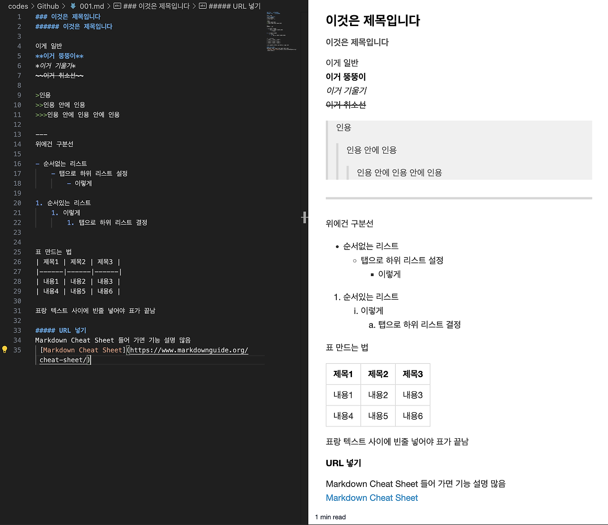

### Markdown 기본 사용법
마크다운(Markdown)은 텍스트를 쉽게 서식화할 수 있도록 만든 가벼운 마크업 언어이다.
문서를 작성할 때 HTML 같은 복잡한 태그를 쓰지 않고 간단한 기호만으로도 텍스트를 꾸미거나
링크, 이미지 등을 추가할 수 있게 해준다. 
마크다운은 주로 **README 파일**이나 **블로그 포스트, 문서화** 작업에서 많이 사용된다. 

**대표적인 기능을 꼽자면**

1. 제목 만들기(큰제목, 작은제목)
2. **굵은 글씨**
3. *기울임 글씨*
4. 링크넣기
5. 이미지넣기
6. 리스트넣기(순서없는 리스트, 순서있는 리스트)
7. 코드블록
이 있다. 

마크다운의 사용법은
아래 그림처럼 보는게 가장 직관적인 것 같다.
왼쪽은 **마크다운을 작성 창**이고 오른쪽은 **출력 결과**를 보는거다.
VSCode의 마크다운 확장으로 마크다운 문서를 만들면 미리보기가 가능하다! 

**마크다운 참고 사이트**
[Markdown Cheat Sheet](https://www.markdownguide.org/cheat-sheet/)
https://www.markdownguide.org/cheat-sheet/

이 사이트는 여러 마크다운 치트가 잘 정리되어 있다. 마크다운을 다채롭게 쓰고 싶다면 한번 보는 걸 추천한다. 표로 쉽게 잘 설명되어있다.

좀 유용해보였던 기능은 아래처럼 체크박스를 만드는 기능이였다. 

- [x] Write the press release
- [ ] Update the website
- [ ] Contact the media

