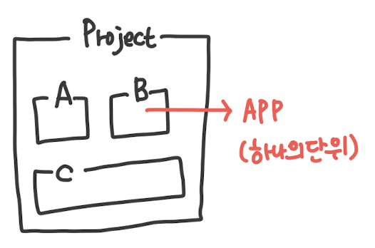

# 2024년 12월 17일 화요일 (Tuesday, December 17, 2024)

## 할일
- [x] ML 기말

## Django project
- **`settings.py`** - 프로젝트의 설정을 관리하는 곳  
- **`urls.py`** - 어떤 요청을 처리할지 결정하는 곳  
- **`\_\_init\_\_.py`** - 하나의 폴더를 하나의 파이썬 패키지로 인식하도록 하는 파일  
- **`wsgi.py`** - 웹 서버 관련 설정 파일  
- **`manage.py`** - Django 프로젝트 유틸리티 (조종기)  

**→ 우리는 `settings.py`와 `urls.py`만 잘 사용하면 된다!**

- 어떤 웹 프로그램이던지 하나의 기능만 하지는 않는다.
- 여러 웹 프로그램을 보면 공통된 기능이 존재한다.

## Django App
- 내가 생각하는 하나의 기능 덩어리 (단위)
- 하나의 프로젝트는 여러개의 앱이 있을 수 있음(유저 기능, 아티클 기능, 좋아요 기능)

- 하나의 앱에 모든 기능 다 구현해도 되긴함
- 유지보수까지 생각해서 선택하면 됨

### APP 사용하기
1. 앱 생성하기
   - manage.py 파일이 있는 상위폴더로 가기
   - 앱 생성 명령어 (예시)
    `python manage.py startapp <articles>`
   <앱 이름> 
2. 앱 등록하기
   - `settings.py` 파일의 `INSTALLED_APPS =` [ ]안 맨 아랫줄에 app 이름 넣기 `"articles",` (예시)

### APP 파일 살펴보기
- **`admin.py`** - 관리자용 페이지 관련 설정  
- **`apps.py`** - 앱 관련 정보 설정  
- **`models.py`** ⭐ - DB 관련 데이터 정의 파일  
- **`tests.py`** - 테스트 관련 파일  
- **`views.py`** ⭐ - 요청을 처리하고 처리한 결과를 반환하는 파일

## 클라이언트와 서버
  - Web에 대한 이해 필요함
  - 우리가 사용하는 대부분의 서비스는 클라이언트-서버 구조를 가지고 있음
  - 결국 클라이언트도 서버도 하나의 컴퓨터임

## 요청과 응답
### 웹 브라우저와 웹 페이지
#### 웹 브라우저
  - Safari, Firefox, Chrome, Edge, Opera
#### 웹 브라우저의 역할
  - 인터넷에서 내가 원하는 페이지를 찾아서 보여주고 하이퍼링크를 통해 다른 페이지로 이동할 수 있도록 도와주는 프로그램
  - `HTML`파일을 우리가 보는 예쁜 화면으로 바꿔주는 프로그램 (렌더링, Rendering)
#### 웹 페이지란?
  - 우리가 보는 화면 하나하나가 웹 페이지임

#### 정적 웹 페이지와 동적 웹 페이지
##### 정적 웹 페이지(Static Web page)
  - 작성한 상태를 그대로 제공하는 웹 페이지
  - 모든 상황에서 동일한 내용을 전달
  - 우리가 작성한 HTML
##### 동적 웹 페이지(Dynamic Web Page)
  - 요청에 따라 보여주는 모습이 달라지는 웹 페이지
  - 수정이 된다는 것은 누군가 그걸 바꿔준다는 것
    - 이 수정의 주체가 **Django** 이다.

### 프론트엔드와 백엔드
#### 백엔드 개발
  - 보이지 않는 서버측의 작업을 담당 (데이터베이스와 상호작용)
  - 데이터베이스와의 상호작용, 비즈니스 로직  처리, 보안, 사용자 인증 등을 처리
  - 사용자가 요청한 데이터를 처리하고 그에 따른 결과를 생성
  - 주로 서버 사이드 언어 및 프레임워크를 사용하여 개발되며, 데이터베이스와의 통신을 담당

#### 프론트엔드 개발
  - 디자이너가 만든 **웹 페이지를 기반으로 더욱 동적이고 상호작용적인 웹 어플리케이션 개발**
  - 주로 JavaScript 프레임워크나 라이브러리를 사용하여 프론트엔드 기능을 개발하고, 데이터 처리와 상태 관리를 담당
  - 백엔드와의 통신을 위한 API 요청 및 응답 처리, 데이터의 가공 및 표시, 사용자 입력에 대한 반응 등을 담당

### 웹 개발의 요청과 응답

### Django 설계 철학 - MTV Pattern
#### 소프트웨어 디자인 패턴
소프트웨어도 소프트웨어 디자인패턴이 있음
예시: 클라이언트-서버 구조

#### Django의 Design Pattern
- Django의 설계 철학에도 디자인 패턴이 적용되어 있음 **(MTV Pattern)**
  - 원래 있던 MVC 디자인 패턴을 살짝 변형한 것

#### MVC 디자인 패턴 
- `Model` - `View` - `Controller `
- **Model:** 데이터와 관련된 로직을 처리
- **View:** 레이아웃과 관련 된 화면을 처리
- **Controller:** Model과 View를 연결하는 로직을 처리

#### Django의 MTV 패턴 
사실 거의 유사함
| **MVC**       | **MTV**      |
|:---------------:|:--------------:|
| **M**odel    | **M**odel    |
|**V**iew     | **T**emplate |
| **C**ontroller| **V**iew   |

##### ⭐MTV Pattern⭐
- **Model**
  - MVC에서의 Model
  - 데이터 관련 처리
- **Template**
  - MVC에서의 View
  - 레이아웃과 화면상의 로직을 처리
  - UI와 레이아웃
- **View**
  - MVC에서의 Controller
  - Model & Template 중간 로직 처리
  - 메인 비즈니스 로직을 담당 
