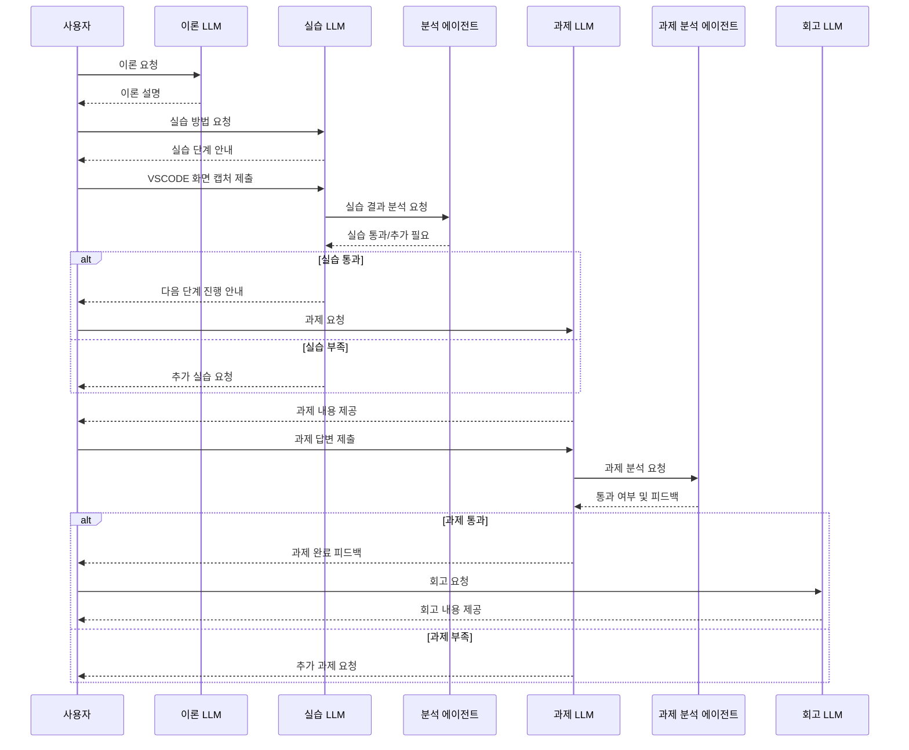
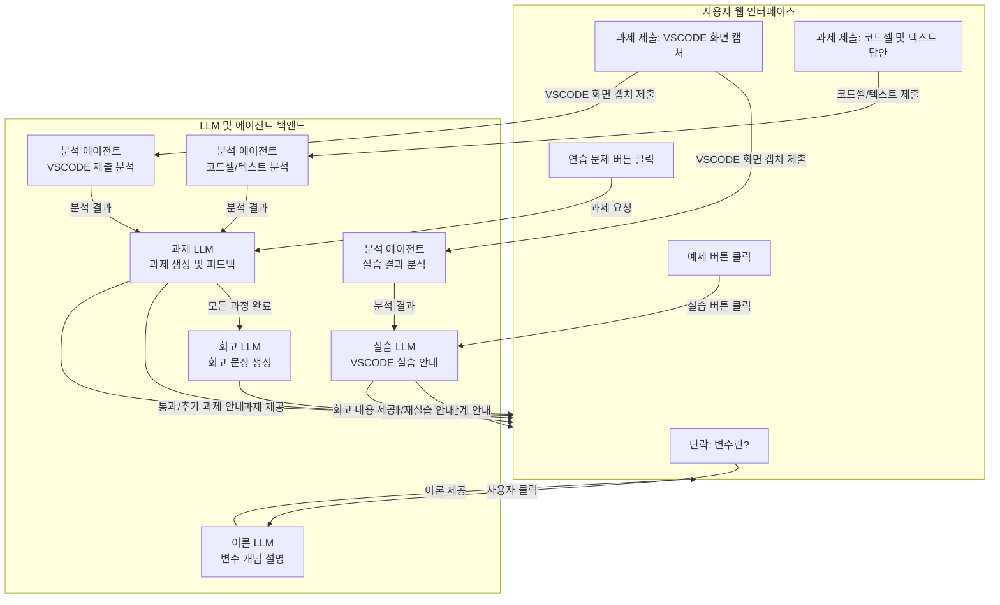
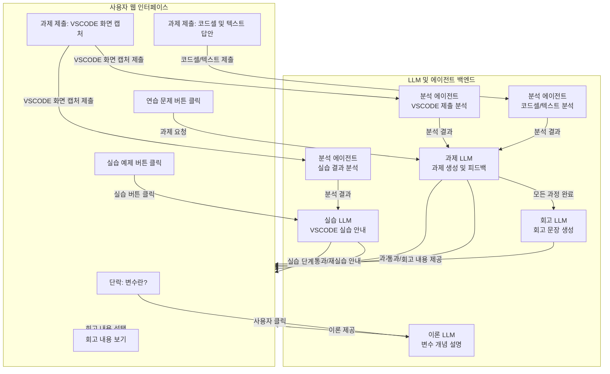

# 2024년 1월 11일 토요일 (Friday, January 11, 2025)
## 할일 
- [ ] 멀티에이전트 이론 보충
- [ ] 튜터링 에이전트 로직 짜기

**Conventional RAG 문제점**
- RAG 파이프라인이 단방향 구조로 되어있어서 모든 단계를 한번에 다 잘해야한다.
- 이전 단계로 되돌아가기가 어렵다.

**LangGraph 장점**
- 각 세부 과정을 노트(Node)로 정의
- 이전 노드 -> 다음노드를 엣지(Edge)로 정의함
- 조건부 엣지를 통해 분기 처리

RAG 파이프라인을 보다 유연하게 설계할 수 있음

---

## LLM과 에이전트 기능 분리
전부다 실시간으로 처리하기에는 LLM 생성 시간이 꽤 걸리는 것도 그렇고, 토큰비용도 그렇고 확실히 어려움

