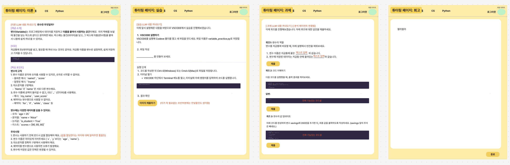
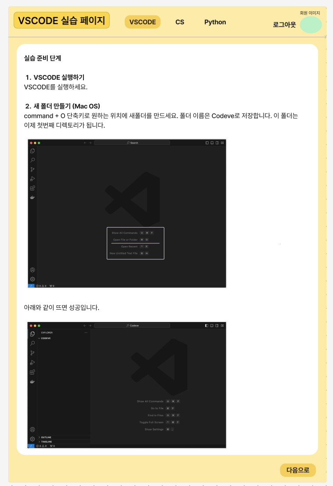

# 2024년 1월 13일 월요일 (Monday, January 13, 2025)
- [ ] 이론 LLM, 실습 LLM 자료 만들어서 데이터베이스에 올려서 웹 연결해보기
- [x] 과제 에이전트 구현
- [x] 코드 셀

## 추가 와이어프레임
머릿속에만 있으니까 더 어려운거 같아서 추가함



## 현재 진행 점검
1. 파일 기반 구조 체크
   - 이론 내용은 .md 파일로 저장
   - 메타 데이터는 .json으로 관리
   - 실습 코드는 .py로 분리

### 개선해야 될 점
**상태 관리 부분**
학습 진행 상태 업데이트, 다음 학습 토픽 반환, 사용자 학습 경로 생성이 필요해보임
`utils.py` 하나 만들어서 `class CourseStateManager:` 정의.. 해야하는데 학습진행상황 어떻게 할..하지? 

**에러처리와 재시도 메커니즘**
재시도 기반 에러 처리..

## 앞으로의 방향성 
1. API 엔드포인트 구성:
2. 비동기 작업 큐 도입:
긴 시간이 걸리는 콘텐츠 생성은 백그라운드로 처리
상태 업데이트를 웹소켓으로 전달
3. 캐싱 시스템
4. 모니터링 시스템


## 과제 입력받을 코드 셀 만들고 연결
에이전트 통합 테스트 추가
인증 시스템 보완


## Git 충돌을 해결 하기 위한 단계들
develop으로 머지하다가...........

ref.
https://www.freecodecamp.org/korean/news/how-to-resolve-merge-conflicts-in-git/


## Issue
### Issue 1. 브랜치가 리모트와 연결되지 않았을 때
**문제상황**
로컬에서 새로운 브랜치를 생성하고 작업한 후 리모트에 푸시하려고 했으나, 아래와 같은 에러메시지가 발생:
```
fatal: The current branch <branch-name> has no upstream branch.
To push the current branch and set the remote as upstream, use

    git push --set-upstream origin <branch-name>
```
**원인**
- 로컬에서 브랜치를 생성했지만, 리모트 저장소에 동일한 브랜치를 생성하거나 연결(Tracking)하지 않음
- 기본적으로 Git은 새로 생성한 브랜치를 리모트와 자동으로 연결하지 않음

**해결방법**
1. 현재 브랜치를 리모트와 연결하고 푸시
```bash
git push --set-upstream origin <branch-name>
```
- `<branch-name>` 에는 연결하려는 브랜치 이름을 입력하기
- **예시:** `git push --set-upstream origin jinee`


## Issue 2. SECRET_KEY 누락

**문제 상황**
Django 프로젝트를 실행하는 중, 서버에서 아래와 같은 에러가 발생:
```
django.core.exceptions.ImproperlyConfigured: The SECRET_KEY setting must not be empty.
```
**원인**
- 충돌 해결 하면서 프로젝트 복구 과정에서 settings.py 파일의 SECRET_KEY를 불러오는 방식이 변경되었거나 누락되었음.
- 이는 협업 중 Git 머지(merge) 과정에서 다른 팀원의 설정 방식이 덮어쓰여 발생한 문제로 추정됨.
- 원래는 .env 파일에서 SECRET_KEY를 로드하는 방식이었으나, 충돌 해결 후 설정이 반영되지 않음.

**트러블슈팅**
1. 문제 확인
- settings.py 파일에서 SECRET_KEY 값을 불러오는 로직을 점검
- 다른 방식으로 SECRET_KEY를 하드코딩한 설정이 적용되었음을 확인
2. SECRET_KEY 복구
   - .env 파일이 SECRET_KEY를 로드하도록 코드를 복원:
```python
from dotenv import load_dotenv
import os

load_dotenv()
SECRET_KEY = os.getenv('SECRET_KEY')
```

   - .env 파일에 새로운 랜덤 SECRET_KEY 값 만들어서 다시 추가
```
SECRET_KEY=랜덤_키
```

**문제 예방**
- 팀원 간의 협업 과정에서 환경 변수 관리 방법을 통일. 예를 들어, settings.py에서 환경 변수를 사용하는 방식은 다음과 같이 표준화:
    ```python
    from dotenv import load_dotenv
    import os

    load_dotenv()
    SECRET_KEY = os.getenv('SECRET_KEY', 'default-secret-key-for-dev')
    ```

**회고**
이번 문제는 Git 충돌 해결 과정에서 발생한 실수로, SECRET_KEY를 불러오는 방식이 팀원 간에 일관되지 않아 발생하였다. 이는 협업 환경에서 충분히 발생할 수 있는 상황으로, 앞으로는 환경 변수 관리와 Git 머지 과정에서 설정파일을 꼼꼼히 확인하는 습관을 들이기로 했다. 또한, 팀원들과 통일된 환경 관리 방안을 논의하여 유사한 문제가 발생하지 않도록 방지할 예정이다.
