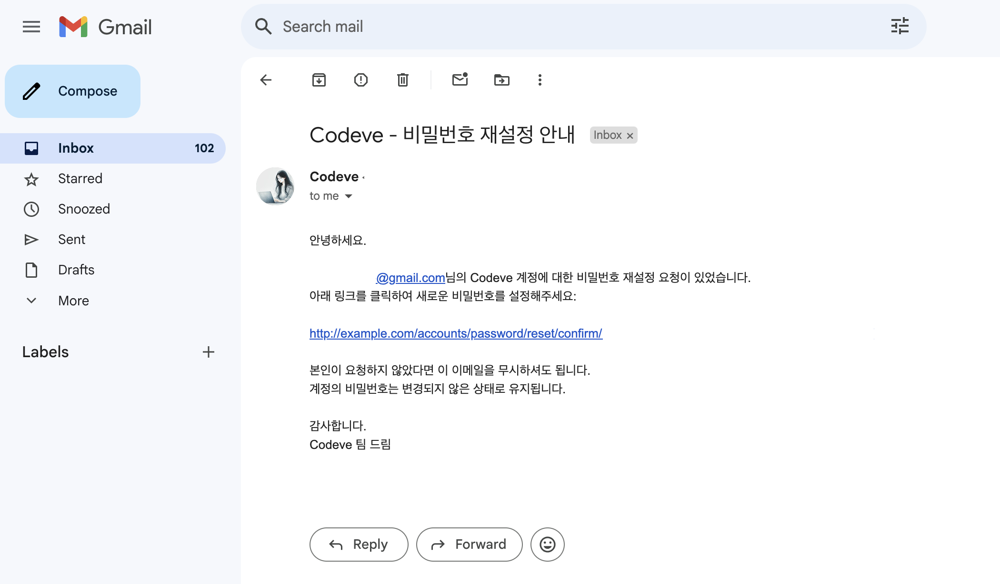

# 2024년 1월 15일 화요일 (Wednesday, January 15, 2025)
## 목표
- [x] 트러블슈팅 하나 이상 적기

## 할일
- [ ] 과제 에이전트 마저 구현
- [ ] 프롬프트 깎자


## 특정 항목 선택 후 다음 버튼 클릭 시 잘못된 페이지로 이동하는 문제 해결
**문제 상황**
목차에서 특정 항목(예: 입출력, 모듈, 함수 등)을 선택한 뒤 '다음' 버튼을 클릭하면, 올바른 페이지로 이동하지 않고 다른 변수 페이지로 잘못 이동하는 문제가 발생함. 이는 URL에 topic_id가 제대로 반영되지 않아서 발생한 문제였음

**원인 분석**
theory-lesson.html 및 관련 템플릿(practice.html, assignment.html)에서 탭 네비게이션 및 버튼의 URL이 현재 topic_id를 포함하지 않는것이 문제의 원인이였음. 따라서 선택한 항목의 컨텍스트가 유지되지 않아 잘못된 페이지로 리디렉션됨 

**해결 방법**
URL에 topic_id를 포함시키도록 템플릿을 수정하였다. 특히 theory-lesson.html 및 관련 템플릿(practice.html, assignment.html)에서 탭 네비게이션 및 다음/이전 버튼의 URL을 수정하여 topic_id가 동적으로 반영되도록 변경

수정된 템플릿 코드: 
```python
<!-- Tab Navigation -->
<div class="flex justify-center space-x-4 mb-8">
    <a href="" class="px-6 py-2 bg-yellow-200 rounded-lg hover:bg-yellow-300">이론</a>
    <a href="" class="px-6 py-2 bg-yellow-300 rounded-lg font-medium">실습</a>
    <a href="" class="px-6 py-2 bg-yellow-200 rounded-lg hover:bg-yellow-300">과제</a>
    <a href="" class="px-6 py-2 bg-yellow-200 rounded-lg hover:bg-yellow-300">회고</a>
</div>
```
**추가 개선 사항**
템플릿 파일 간에 중복된 코드가 많아 유지보수 효율성을 높이기 위해 추후 공동 템플릿으로 리팩토링 할 생각이 있음. 이를 통해 코드를 더 간결하게 관리하고, 유사한 문제가 발생할 가능성을 줄일 수 있을것으로 보임

## 이메일 발송 기능 트러블슈팅
**문제 상황**
Django 애플리케이션에서 비밀번호 재설정 이메일을 발송할 때, SMTP 인증 오류가 발생하여 이메일이 발송되지 않는 문제가 생긴다고 전달받음. 해당 부분이 작동되는지 확인 겸 코드 구조를 약간 개선해보았음

**해결 과정**
1. Gmail 앱 비밀번호를 새로 생성하였음. 해당 비밀번호는 .env에 추가
   - `EMAIL_HOST_USER_PASSWORD='내_16자리_구글_앱_비밀번호'`
2. Django 설정 업데이트
   - `Codeve/settings.py`에서 이메일 설정을  환경 변수로부터 가져오도록 수정함
3. 발신자 이메일 수정
   - `from_email = 'Codeve <no-reply@codeve.com>'`
4. 테스트
   - 설정을 완료한 후, 서버를 재시작하고 비밀번호 재설정 기능을 테스트하여 이메일이 정상적으로 발송되는지 확인
**결과**
이메일 발송 기능이 정상적으로 작동하게 되었으며, 사용자는 자신의 이메일로 비밀번호 재설정 링크를 받을 수 있게 됨



**추가 개선 사항**
forms.py에 발신자 메일을 하드코딩시켜놨는데, 나중에 삭제 할 예정. 다른데 있어서 여기에 굳이 없어도 됨

## 아이디어 
알쓸신잡에 기술 용어 발음 가이드도 몇개 추가하면 좋을 것 같다. 기술 및 학계에서는 전문 용어를 처음 접하는 경우가 많은거 같음. 그러나 실무 경험이 없거나 용어를 직접 듣고 익힐 기회가 부족한 경우, 올바른 발음을 알기 어려운듯 함. 이는 발표나 토론 중 의사소통에 지장을 줄 수 있으므로, 알쓸신잡(이라고 우리 팀 끼리는 부르지만 아카이브)에 넣어서 알려주면 좋지 않을까?

**예시:**
Embedding은 [임베딩]이라고 읽습니다.
UIzard는 [유아이자드]라고 읽습니다.

---

## 중간발표회 피드백 요약 
"LLM 모델이 'VSCode', 'VSCODE'처럼 용어 표기가 통일되지 않았다."라는 피드백을 받았다. 이는 더 높은 완성도를 위해 보완하면 좋을 부분이라는 따뜻한 조언을 해주셔서 감사한 마음이 들었다.

**내 의견**
기획과 기능 구현 일정이 다른 팀에 비해 조금 더 타이트해졌던 상황에서, 팀원들과 튜터님의 도움을 주고받으며 최소 기능 구현에 집중하다 보니 프롬프트의 세부 사항을 꼼꼼히 챙기지 못했던 것이 사실이다. 발표 전에도 해당 문제를 인지했지만, 우선순위에서 밀려나 있었던 부분이라 관과한 점이 있었다. 이런 피드백을 통해 이런 디테일이 프로젝트의 완성도를 높이는 데 중요하다는 것을 다시 한번 느끼게 되었다. 앞으로 이러한 세부적인 부분까지 신경 쓰며 프로젝트의 퀄리티를 한 단계 더 높여보려고 한다.  

## 중간발표회 회고
우리 팀의 기술적 의사결정이 충분히 논리적으로 설득력있게 이루어지고 있는지에 대해 팀원들과 함께 점검하고자 한다. 단순히 결정하는 데 그치지 않고, 구체적인 이유와 근거를 기반으로 한 의사소통이 이루어질 수 있도록 노력하려고 한다. 이를 위해 관련 내용을 체계적으로 문서화하여 의사결정 과정을 명확히 기록하고, 향후 참고자료로 활용할 수 있도록 꼼꼼히 관리하고자 한다. 

---

근데......! 오늘 발표 준비하고 특강도 듣고 이메일 발송 기능 조금 고치고 하느라고 내 파트 기능개발 하나도 못했다ㅠㅠ!!!! (근데 이러면 오늘 한 일은 zero인 걸까...?🤔 나름 열심히 했는데 말이지 🥲 )