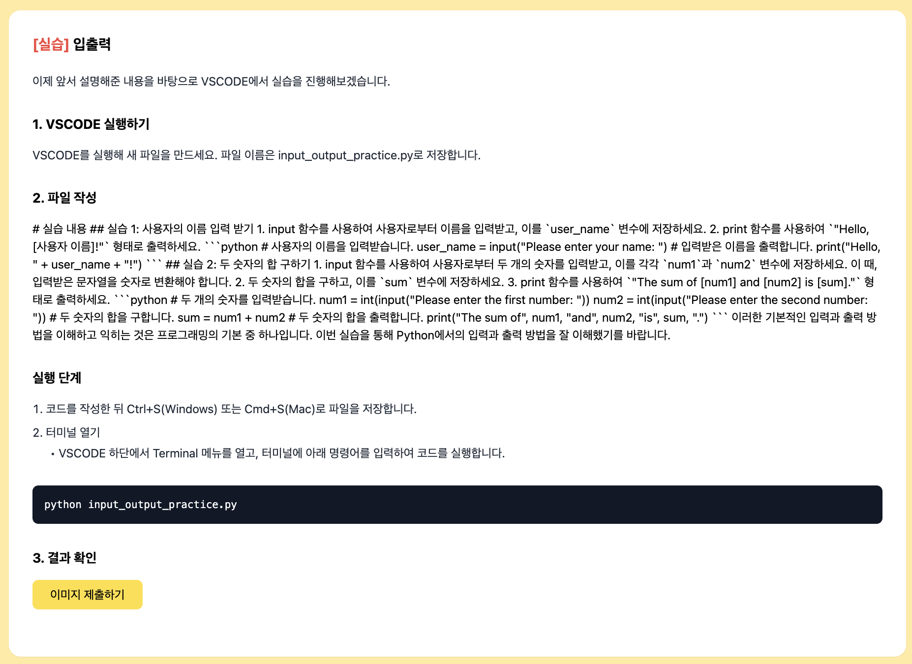
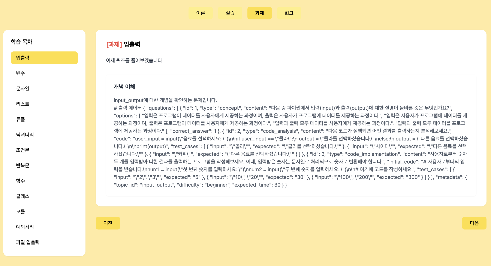
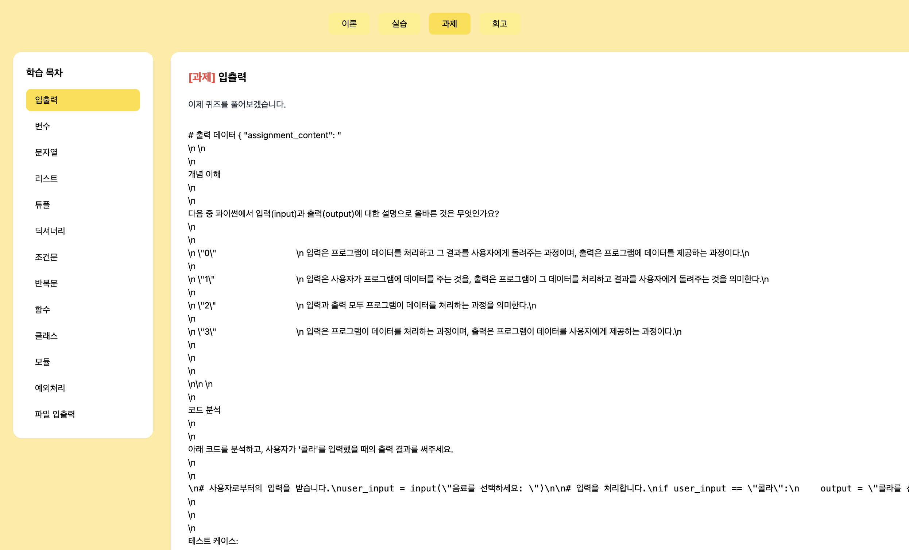
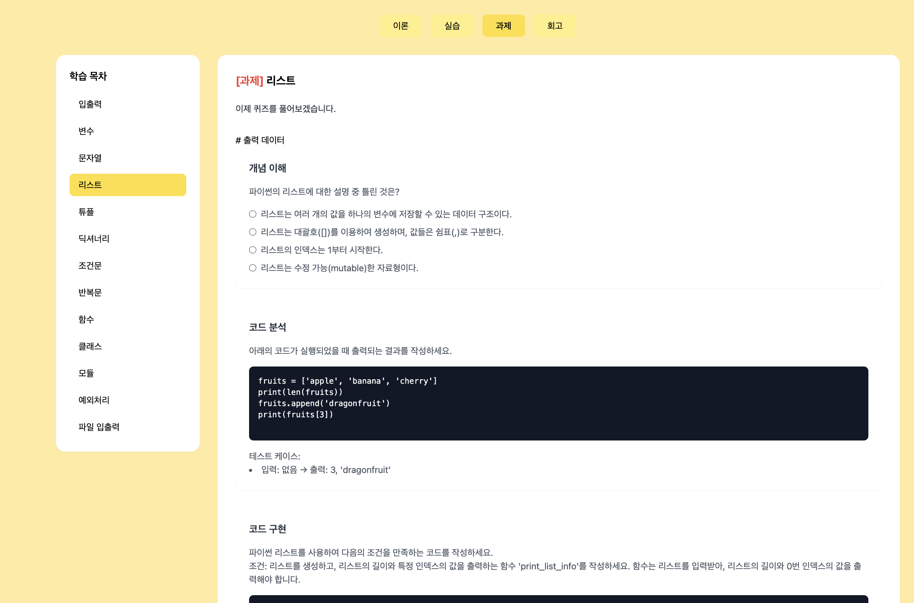

# 2024년 1월 22일 화요일 (Thuesday, January 22, 2025)
## 할일
- [ ] 자동화 스크립트로 만들기

## 정리해야하는거
- [ ] 지금 data 폴더에 content만 쓸건데, 과제 생성기에 불필요하게 current, versions 만드는 스크립트가 아직 들어있음. 

### LLM과 생성 스크립트를 분리한 구조
1. 관심사 분리
   - LLM 클래스들은 순수하게 콘텐츠 생성 로직에만 집중
   - 생성 스크립트들은 실행 환경과 오케스트레이션을 담당
2. 유연성
   - 개별 스크립트로 필요한 부분만 재생성 가능
   - 다양한 생성 시나리오 대응 가능
3. 유지보수성
   - 각 파일의 책임이 명확해서 디버깅이 쉬움
   - 코드 수정이 다른 부분에 영향을 덜 미침


### CLI로 스크립트 통합
courses/scripts/cli.py

하나의 통합된 CLI로 모든 기능을 사용할 수 있음.
사용 예시: 
```
# 모든 콘텐츠 생성
python -m courses.scripts.cli generate

# 특정 토픽의 과제만 생성
python -m courses.scripts.cli generate --type assignment --topic variables

# 템플릿 초기화
python -m courses.scripts.cli init

# 콘텐츠 검증
python -m courses.scripts.cli validate
```

통합 후 다음 파일들 삭제함
1. 개별 생성 스크립트들
```
courses/scripts/generate_theory.py
courses/scripts/generate_practice.py
courses/scripts/generate_assignment.py
courses/scripts/generate_all.py
courses/scripts/initialize_assignments.py
```
이유: 
   - 모든 생성 로직을 `ContentGenerator`로 통합함
    (courses/llm/__init__.py)
   - CLI를 통해 모든 기능을 사용할 수 있게 됨
   - `initialize_assignments.py`의 로직도 `ContentGenerator.initialize_templates()`로 이동

남겨둘 파일들:
```
courses/scripts/cli.py                                  # CLI 인터페이스
courses/llm/__init__.py                                # ContentGenerator 클래스
courses/config/generation.yaml                         # 설정 파일
courses/agent_docs/agent_prompt/reflection_llm_prompt.md  # 프롬프트 템플릿
courses/llm/assignment_llm.py                          # LLM 구현체
```

**CLI로 토픽 생성하는 방법**
```
# 모든 토픽 생성
python -m courses.scripts.cli generate --type all

# 특정 파트의 토픽 전체 생성하기 (practice 파트)
python -m courses.scripts.cli generate -t practice

# 특정 파트의 특정 토픽 하나만 생성하기 (practice에 토픽 중 input_output으로 )
python -m courses.scripts.cli generate -t practice --topic input_output
```

---

데이터를 다시 만들었고, 이제 데이터와 템플릿을 연결해야한다.
views.py에서 데이터를 불러오는 부분을 구현하기

변경 사항:
`course_list.json`을 courses/agent 디렉토리에 있었는데, 
data 디렉토리로 이동시킴


트러블 슈팅

생성된 practice.json의 문제
1. 형식이 잘못됨:
HTML 구조로 되어있어야 하는데, JSON 형식으로 나오고 있음
practice_llm_prompt.md에서 정의한 섹션 구조(<section class="mb-8">...)를 따르지 않음
2. 내용이 잘못됨:
이론 내용을 그대로 복사한 것 같음
실습 가이드로 변환되지 않음

PracticeLLM 클래스의 generate 메서드에서 프롬프트가 제대로 처리되지 않는 것 같음. 따라서 practice_llm.py에서 generate 메서드 일부를 수정함 
```
        # 실습 내용 생성
        messages = [{
            "role": "system",
            "content": "당신은 Python 실습 튜터입니다. 이론 내용을 바탕으로 실제 실습할 수 있는 내용을 생성해주세요."
        }, {
            "role": "user",
            "content": f"""# 입력 데이터
{json.dumps(input_data, indent=2, ensure_ascii=False)}
```

2. 생성된 내용이 계속 HTML 형식이 아닌 마크다운 형식으로 나옴
PracticeLLM의 generate 메서드에서 system 메시지를 더 구체적으로 수정함
```python
        # 실습 내용 생성
        messages = [{
            "role": "system",
            "content": """당신은 Python 실습 튜터입니다. 
반드시 다음 HTML 구조를 사용하여 실습 내용을 생성해야 합니다:

<section class="mb-8">
    <h2 class="text-lg font-semibold text-black-600 mb-3">실습 환경 설정</h2>
    <p class="text-gray-800 leading-relaxed">
        {VSCode 설치 및 환경 설정 방법}
    </p>
</section>

<section class="mb-8">
    <h2 class="text-lg font-semibold text-black-600 mb-3">이론 예제 실습</h2>
    <p class="text-gray-800 leading-relaxed">
        {실습 설명}
    </p>
    <div class="bg-gray-900 rounded-lg p-4 mt-4">
        <pre class="text-white font-mono text-sm">{예제 코드}</pre>
    </div>
</section>

<section class="mb-8">
    <h2 class="text-lg font-semibold text-black-600 mb-3">실행 방법</h2>
    <ol class="list-decimal list-inside space-y-4 text-gray-800">
        {실행 단계}
    </ol>
</section>"""
        }, {
            "role": "user",
            "content": f"""# 입력 데이터
{json.dumps(input_data, indent=2, ensure_ascii=False)}
```


---
assignment 뜯어 고치기

과제는 json 형식으로 생성되었지만, HTML로 렌더링되지 않아서 화면에 표시되지 않음. assignment_llm.py를 수정해서 HTML 형식으로 출력하도록 바꾸기

```python
        assignment_data = json.loads(response.generations[0][0].text.replace("# 출력 데이터\n", ""))
        
        # JSON을 HTML로 변환
        html_content = f"""
<div class="space-y-8">
    <!-- 개념 이해 문제 -->
    <section class="bg-white rounded-lg shadow-sm p-6">
        <h2 class="text-lg font-semibold text-gray-800 mb-4">개념 이해</h2>
        <div class="prose max-w-none text-gray-600">
            <p>{assignment_data['questions'][0]['content']}</p>
            <div class="mt-4 space-y-2">
                {' '.join(f'''
                <div class="flex items-center">
                    <input type="radio" name="q1" value="{i}" class="mr-2">
                    <label>{option}</label>
                </div>''' for i, option in enumerate(assignment_data['questions'][0]['options']))}
            </div>
        </div>
    </section>

    <!-- 코드 분석 문제 -->
    <section class="bg-white rounded-lg shadow-sm p-6">
        <h2 class="text-lg font-semibold text-gray-800 mb-4">코드 분석</h2>
        <div class="prose max-w-none text-gray-600">
            <p>{assignment_data['questions'][1]['content']}</p>
            <div class="bg-gray-900 rounded-lg p-4 my-4">
                <pre class="text-white font-mono text-sm overflow-x-auto">
{assignment_data['questions'][1]['code']}
                </pre>
            </div>
            <div class="mt-4">
                <p>테스트 케이스:</p>
                <ul class="list-disc list-inside">
                    {' '.join(f'<li>입력: {case["input"]} → 출력: {case["expected"]}</li>' for case in assignment_data['questions'][1]['test_cases'])}
                </ul>
            </div>
        </div>
    </section>

    <!-- 코드 구현 문제 -->
    <section class="bg-white rounded-lg shadow-sm p-6">
        <h2 class="text-lg font-semibold text-gray-800 mb-4">코드 구현</h2>
        <div class="prose max-w-none text-gray-600">
            <p>{assignment_data['questions'][2]['content']}</p>
            <div class="bg-gray-900 rounded-lg p-4 my-4">
                <pre class="text-white font-mono text-sm overflow-x-auto">
{assignment_data['questions'][2]['initial_code']}
                </pre>
            </div>
            <div class="mt-4">
                <p>테스트 케이스:</p>
                <ul class="list-disc list-inside">
                    {' '.join(f'<li>입력: {case["input"]} → 출력: {case["expected"]}</li>' for case in assignment_data['questions'][2]['test_cases'])}
                </ul>
            </div>
        </div>
    </section>
</div>
"""

        # 과제 내용 저장
        assignment_file = self.data_dir / topic_id / 'current' / 'assignment.json'
        assignment_file.parent.mkdir(parents=True, exist_ok=True)
        
        with open(assignment_file, 'w', encoding='utf-8') as f:
            json.dump({
                'content': html_content,
                'metadata': {
                    'created_at': datetime.now().isoformat(),
                    'version': 1
                }
            }, f, indent=2, ensure_ascii=False)

        return html_content
```


`python -m courses.scripts.cli generate -t assignment --topic input_output`

---
트러블슈팅 

JSON 파싱에 실패. assignment_llm.py에서 LLM이 생성한 응답을 JSON으로 파싱하는 과정에서 문제가 발생. assignment_llm.py를 수정함.

주요 변경사항:
LLM 응답을 바로 HTML로 변환
JSON 파싱 단계 제거
시스템 프롬프트를 템플릿 파일에서 직접 로드
응답을 HTML 구조에 직접 삽입


문제
렌더링이 좀 희안함 


주요 변경사항:
시스템 프롬프트를 HTML 형식으로 변경 (practice와 비슷한 스타일)
JSON 파싱 단계 제거
**LLM이 직접 HTML을 생성하도록 함**
이제 다시 실행하면 practice와 비슷한 형식으로 과제가 생성됨.


JSON으로 만들었다, HTML로 만들었다. 
프롬프트도 두군데에 있고..


템플릿이 계속 바껴서 템플릿은 최대한 건드리지 않았음.

문제



같은 스크립트를 써서 동시에 만들었는데, 어떤건 이상하고 어떤건멀쩡하고?

현재 문제가 발생하는 이유를 분석해보면:
1. LLM의 응답이 일관적이지 않음:
- 때로는 HTML 형식으로 응답
- 때로는 JSON 형식으로 응답
- 때로는 "# 출력 데이터" 같은 prefix를 붙임

2. 현재 assignment_llm.py의 문제점:
```python
response = await self.llm.agenerate([messages])
html_content = response.generations[0][0].text  # 바로 응답을 사용
```

해결방법:
응답을 파싱하고 정제하는 과정이 필요함

```python
        response = await self.llm.agenerate([messages])
        response_text = response.generations[0][0].text
        
        # 응답 정제
        if "# 출력 데이터" in response_text:
            response_text = response_text.replace("# 출력 데이터\n", "")
        
        # JSON 형식이면 파싱
        if response_text.strip().startswith("{"):
            try:
                data = json.loads(response_text)
                if "assignment_content" in data:
                    html_content = data["assignment_content"]
                else:
                    html_content = response_text
            except json.JSONDecodeError:
                html_content = response_text
        else:
            html_content = response_text
        
        # HTML 형식 확인
        if not html_content.strip().startswith("<div"):
            html_content = f"""
<div class="space-y-8">
    {html_content}
</div>
"""
        
        # 저장 및 반환
        assignment_file = self.data_dir / topic_id / 'current' / 'assignment.json'
        assignment_file.parent.mkdir(parents=True, exist_ok=True)
```

이렇게 수정하면:
1. "# 출력 데이터" prefix 제거
2. JSON 형식이면 파싱해서 HTML 추출
3. HTML 형식이 아니면 div로 감싸기

---

### 심볼릭링크(Symbolic Link)
심볼릭링크는 파일 시스템에서 특정 파일이나 디렉토리로 가는 **"가상 경로"를 생성하는 링크**이다. 마치 바로 가기(shortcut)와 비슷하지만, 좀 더 강력한 기능을 제공한다.

심볼릭 링크의 특징 
1. 가상 파일 또는 디렉토리
   - 심볼릭 링크는 진짜 파일이 아니라, 다른 파일이나 디렉토리의 경로를 참조하는 파일이다.
   - 원본 파일이 이동하거나 삭제되면 심볼릭 링크는 깨진 링크(broken link)가 된다.
2. 절대 경로 vs 상대 경로
   - 심볼링 링크는 절대 경로(예: /Users/username/Documents/file.txt) 또는 상대 경로(예: ../file.txt)를 참조할 수 있다.
3. 다른 파일 시스템에서도 작동
   - 하드 링크와 달리, 심볼릭 링크는 다른 파일 시스템(다른 디스크나 파티션)에도 적용 가능하다/
4. 링크 파일의 크기
   - 심볼릭 링크 자체의 크기는 작으며, 원본 파일의 경로 정보만 저장한다.

--- 
**문제**
심볼릭 링크 넣었는데 루트 경로만 공유되었음

**왜 루트 경로만 공유되었을까?**

심볼릭 링크는 원본 파일의 위치를 참조한다. 따라서:
- 공유한 링크가 절대 경로를 참조하는 경우:
심볼링 링크가 있는 시스템에서만 경로가 유효하며, 다른 컴퓨터에서는 해당 경로가 존재하지 않으므로 파일을 열 수 없다.
- 공유 대상에게는 원본 파일이 필요하다. 심볼릭 링크 자체는 파일 내용을 포함하지 않기 때문에, 원본 파일을 접근할 수 있는 경로 또는 파일 자체를 공유해야 한다.

**심볼릭 링크를 만드는 방법 (Mac)**
`ln -s [원본 경로] [심볼릭 링크 이름]`

**예시**
1. my_file.txt의 심볼릭 링크 생성:
`ln -s /Users/username/Documents/my_file.txt my_link`
  - my_link라는 심볼릭 링크 파일이 생성한다.
  - 이 파일을 열면 /Users/username/Documents/my_file.txt의 내용을 확인할 수 있다.
2. 디렉토리 링크:
`ln -s /Users/username/Documents my_documents_link`

**올바르게 공유하는 방법**
심볼릭 링크로 공유할 때 아래 사항을 고려해야한다:
1. **절대 경로 대신 상대 경로로 생성하기**
심볼릭 링크를 생성할 때 상대 경로를 사용하면 다른 시스템에서도 링크를 따라갈 수 있다.
예:
`ln -s ../Documents/my_file.txt my_relative_link`

2. **파일 자체를 공유**
심볼릭 링크는 파일을 참조할 뿐, 실제 파일 내용을 포함하지 않으므로 원본 파일을 공유해야 한다.
3. **압축 파일로 묶어 공유**
심볼릭 링크와 참조된 원본 파일들을 함께 압축하여 공유하면, 깨진 링크를 방지할 수 있다.

**해결 방법:**
지금 심볼릭 링크 까지 있을 필요는 없을 것 같아서, 자동화스크립트에서  제거함.


### 소소한 터미널 명령어
**백업**
```
mv courses/data/topics courses/data/topics_backup_$(date +%Y%m%d)
```

`mw`: Move 명령어
`courses/data/topics`: 원본 경로
`courses/data/topics_backup_$(date +%Y%m%d)`: 대상 경로
   - topics의 새 이름
   - `topics_backup_$(date +%Y%m%d)`는 **백업용 디렉토리/파일 이름**을 동적으로 생성

**$(): 명령어 치환**
- `$()`는 **명령어 치환(command substitution)** 으로, 명령어의 실행 결과를 해당 위치에 삽입
- `date +%Y%m%d`의 의미:
  - `date`명령어는 현재 날짜와 시간을 출력
  - `+%Y%m%d`는 출력 형식을 지정함. 4자리 연도, 2자리 월, 2자리 일이 나옴
    - 예: 20250122


---

이론을 DB에 넣었음. 다른 개발자에게 공유하기 위해 fixtures 만들기

## 이론 내용만 추출해서 JSON 파일로 저장
python manage.py dumpdata courses.TheoryContent --indent 2 > courses/fixtures/theory_content.json

## 다른 개발자가 사용할 때 
python manage.py loaddata theory_content
### 첫번째 코드 안되서 전체경로 지정해버림
python manage.py loaddata courses/data/fixtures/theory_content.json

