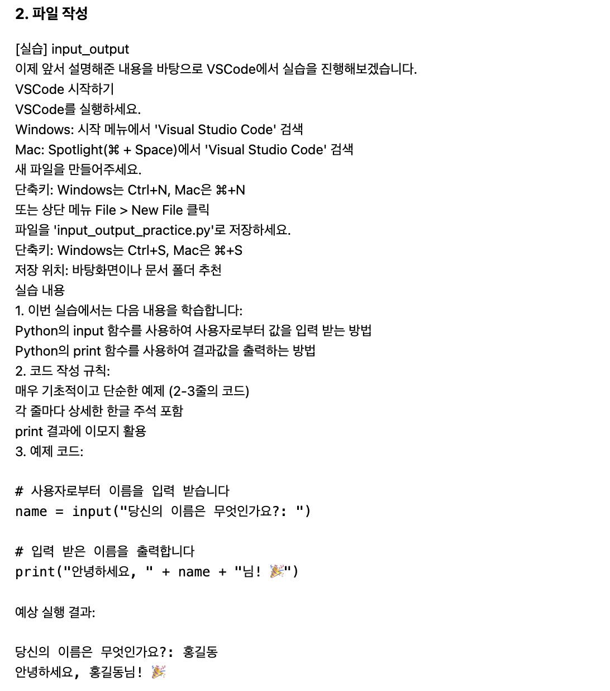

# 2024년 1월 23일 화요일 (Thursday, January 23, 2025)
## 할일
- [x] 브로셔 작성하기
- [x] 실습 스크립트 및 디버깅


## 트러블슈팅 
### 문제: practice_llm_prompt.md 스타일이 적용되지 않음

**원인:**
- 기존 practice_llm_prompt.md의 HTML 구조와 스타일이 Tailwind CSS 스타일과 충돌함.

**해결 방법:**
1. generate 메서드를 수정하여 새로운 HTML 구조를 직접 작성:
```HTML
f"""
<div class="container mx-auto p-6">
    <h1 class="text-2xl font-bold">{title}</h1>
    <pre class="bg-gray-100 p-4 rounded">{json.dumps(input_data, indent=2, ensure_ascii=False)}</pre>
</div>
"""
```
2. `self.prompt_template`를 사용하지 않고 HTML을 직접 정의

**결과**
   - Tailwind CSS 스타일이 적용된 새로운 HTML 구조로 시각적 문제가 해결됨

---

## 참고 사항
- 생성된 실습 콘텐츠 위치:
`courses/data/topics/{topic_id}/content/practice.json`
- HTML 스타일링: Tailwind CSS를 완전 적용하여 일관성과 간소화 달성

## 다음 단계
- 수정한 코드와 스타일을 테스트하고 검증
- 필요한 경우 다른 템플릿에도 새 HTML 구조 적용